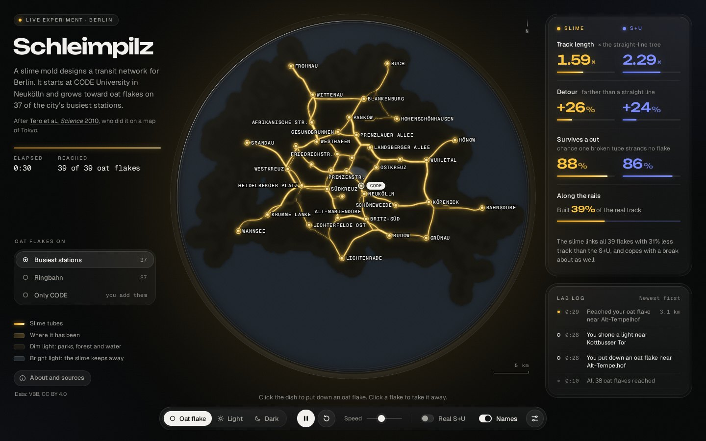

# Schleimpilz

A slime mold grows a transit network across Berlin, in your browser.



In 2010, Atsushi Tero, Toshiyuki Nakagaki and their colleagues put oat flakes on a map of the Tokyo area, one for each big city, and let a slime mold called *Physarum polycephalum* loose on it. They lit the sea and the mountains, because the slime keeps away from light. After a day it had grown a network of tubes between the flakes that looked a lot like the region's railways, and it did about as well on cost, speed and resilience. The paper won them an Ig Nobel Prize.

This is the same experiment for Berlin. The slime starts at CODE University in Neukölln. There's an oat flake on 37 of the city's busiest stations. Outside the city the dish is lit, so the slime stays in Berlin. Once it has found its way around, you can switch on the real S-Bahn and U-Bahn and see how close it got.

## What you can do

- **Watch it grow.** The slime spreads out from CODE as a thin sheet, finds the oat flakes, and then thins out into tubes. Tubes that carry a lot of protoplasm get thicker. Tubes that carry little wither away.
- **Feed it.** Click the dish to put down an oat flake, or click a flake to take it away. The network rebuilds itself around the change.
- **Shine a light.** Drag across the dish with the light tool. The slime keeps away from bright light and its tubes there wither, so you can close a street and watch it reroute.
- **Try other setups.** Put the flakes on the 27 Ringbahn stations, or on nothing but CODE and place them yourself.
- **Compare.** Turn on the real S-Bahn and U-Bahn. The "Slime against rail" panel measures both networks the way the paper did.

Scroll or pinch to zoom into the dish, up to four times. Keys: <kbd>Space</kbd> pause, <kbd>R</kbd> start over, <kbd>N</kbd> real network, <kbd>1</kbd> <kbd>2</kbd> <kbd>3</kbd> tools, <kbd>+</kbd> <kbd>−</kbd> zoom, <kbd>0</kbd> whole dish.

## How the slime works

The dish is covered with a fine mesh of possible tubes, about 400 m apart. The slime grows over it from where it was put down, as a thin sheet with a lobed edge. Once it has found a few oat flakes, protoplasm starts to stream: a few flakes at a time push it in and the others take it up, taking turns. The flow through the mesh follows Kirchhoff's laws, the same rules that decide how current splits in a circuit. Every tube then grows with the flow through it and shrinks without. That feedback is what Tero and colleagues found explains the real organism, and after a while it leaves a network.

Solving for the flow is the expensive part: about 7,700 junctions and 22,000 possible tubes, every step. A multigrid-preconditioned conjugate gradient solver, warm-started from the step before, gets it done in about 3 ms, so the whole thing runs in real time.

Bright light makes a tube much more expensive, and places far from any bus, tram or train stop (forests, lakes, fields) get a dim light and cost a bit more too. The "Lab settings" panel lets you change how hard tubes compete and how much protoplasm flows.

## Slime against rail

The panel compares the slime's network with the part of the S-Bahn and U-Bahn that links the same stations, on the measures from the paper:

- **Track length**: the total length of the network, as a multiple of the straight-line tree that links every oat flake (the minimum spanning tree). A network can come in under 1, because junctions between flakes can make it shorter still.
- **Detour**: how much farther a trip between two flakes is than the straight line, on average over all pairs.
- **Survives a cut**: the chance that one broken link, picked at random, strands no oat flake.

## What it found

After 3,000 steps with the flakes on the 37 busiest stations (`npm run compare`):

| | Slime | S+U | Straight-line tree | Tokyo slime | Tokyo rail |
| --- | --- | --- | --- | --- | --- |
| Track length | 1.41× (202 km) | 2.31× (331 km) | 1× (143 km) | 1.75× | 1.80× |
| Detour | +25% | +24% | +71% | | |
| Survives a cut | 80% | 87% | 0% | 86% | 96% |

The Tokyo columns are the paper's. So with 39% less track, the slime's network is as direct as Berlin's S-Bahn and U-Bahn and nearly as robust, the same kind of result Tero and colleagues found for Tokyo. It built 36% of the real track, and 60% of its tubes run along it. The numbers move a little from run to run, and a lot if you change the lab settings.

## Run it

Open `index.html` in a recent Chrome, Firefox or Safari. It needs WebGL2 and nothing else: no build step, no server. Any static server works too, for example `npx serve .`.

## Develop

```sh
npm install               # data packages and Playwright for the tests
npm run build:data        # rebuild data/berlin.js from the VBB timetable data
npm test                  # run the dish in headless Chromium and take screenshots
npm run test:interaction  # 188 checks with mouse, keyboard and touch
npm run compare           # measure the slime against the S+U, as in the paper
npm run preview           # run the model without a browser and write PNG snapshots
npm run build:single      # write everything into one HTML file in dist/
npm run check:single      # test that file the way the Artifact host serves it
```

| File | What it does |
| --- | --- |
| `index.html`, `style.css` | the page |
| `app.js` | wires the model, the pictures and the controls together |
| `network.js` | the slime: the tube mesh and the flow model |
| `render.js` | draws the dish, the agar, the light and the tubes on the GPU |
| `metrics.js` | measures the slime's network and the real one |
| `ui.js` | draws the oat flakes, names and rail lines over the dish, and the panels |
| `data/berlin.js` | stops, stations, lines and oat flakes, generated by `tools/build-data.mjs` |

## Sources

- A. Tero, S. Takagi, T. Saigusa, K. Ito, D. P. Bebber, M. D. Fricker, K. Yumiki, R. Kobayashi, T. Nakagaki: Rules for Biologically Inspired Adaptive Network Design. *Science* 327 (5964), 439–442 (2010). [doi:10.1126/science.1177894](https://doi.org/10.1126/science.1177894)
- Stops, stations and lines: VBB Verkehrsverbund Berlin-Brandenburg GmbH, [GTFS timetable data](https://unternehmen.vbb.de/digitale-services/datensaetze/), CC BY 4.0, modified. Packaged as [vbb-stations](https://github.com/derhuerst/vbb-stations) and [vbb-lines](https://github.com/derhuerst/vbb-lines) by Jannis R.
- CODE University of Applied Sciences, Donaustraße 44, 12043 Berlin. Its spot on the map is placed by hand and good to about 150 m.
- Fonts: Unbounded, Geist and Geist Mono, from Google Fonts under the SIL Open Font License.
